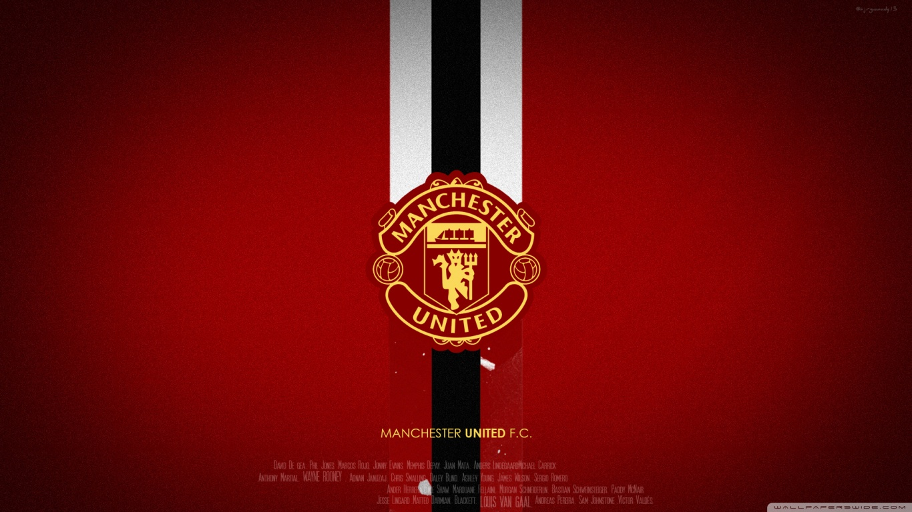

# red-devils-roster :soccer:
A simple API that just gives the current team members of my favourite team, Man United  and their stats .

# Features

* Saves the players info to a monogdb.
* returns player info when query is sent

# TODOS  

* [ ] Use a scrapper to update the players info
